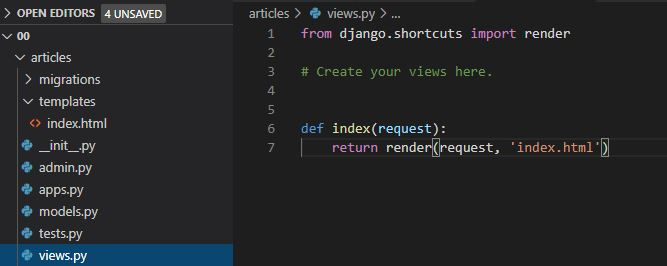
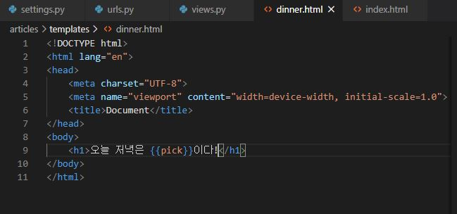
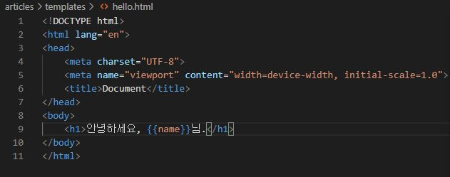
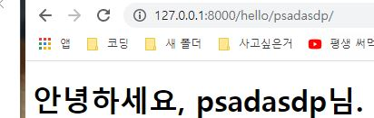
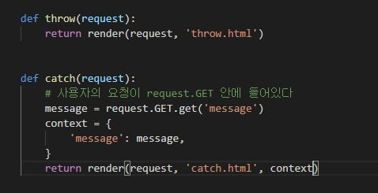

# 00

## django?

- django는 python web framework -> 웹 페이지 개발 과정의 어려움을 줄이는 것이 주된 목적
  - DB 연동, 템플릿 형태의 표준, 세션 관리, 코드 재사용등의 기능을 포함
- 검증되어있는 framework! 
- 일반적으로 특정한 요청을 서버로 보내야 응답을 받아 우리가 웹 페이지를 볼 수 있다.
  - 서버는 스스로 응답하지 않는다! 요청이 필요하다.
- 일반적인 SW의 프레임워크는 모델-뷰-컨트롤러 모델 패턴을 따른다!
- MVC?
  - SW 공학에서 사용되는 소프트웨어 디자인 패턴으로, UI로부터 비즈니스 로직을 분리해 애플리케이션의 시각적 요소, 비즈니스 로직을 서로 영향 없이 쉽게 고칠 수 있는 애플리케이션을 만들 수 있다.
  -  MVC에서 모델은 애플리케이션의 정보(데이터)를 나타내고, 뷰는 텍스트 등의 UI 요소를 나타내고, 컨트롤러는 데이터와 비즈니스 로직 사이의 상호동작을 관리한다. 

- 하지만 Django는 MTV 패턴을 따르고 있다.
  - 모델/템플릿/뷰로 구성되며 MVC와 비교해보면 모델-모델, 뷰-템플릿, 컨트롤러-뷰에 대응된다.
  - 모델은 데이터 관리, 템플릿은 인터페이스, 뷰는 중간 관리(상호 동작)를 담당한다.


# 프로젝트를 만들어보자

- Django 프로젝트를 만드는 명령어는

```
django-admin startproject test123 (.)
```

- 위와 같이 작성하면 test123이라는 프로젝트가 생성이 되고, 해당 디렉터리로 들어가보면 test123안에 test123이 있을 것이다. 이렇게 폴더 안에 프로젝트가 생성되지 않게 하고 현재 경로에서 바로 생성되게 하려면 명령어 마지막에 .을 붙여주면 된다.

- 프로젝트명에는 Python, Django가 사용하는 기본 이름들, 그리고 `-`을 사용하지 않아야 한다.


- startproject 프로젝트명 이후 .을 찍었는지 안 찍었는지에 대한 차이이다. 위의 경우 .을 찍지 않았는데, test123 안에 test123이 존재한다. 

# 뭔 파일들이 있는 걸까

- `__init__.py`: Python으로 하여금 이 디렉터리를 패키지처럼 다루라고 알려주는 용도의 단순한 빈 파일이다.
- `settings.py`: 현재 Django 프로젝트의 환경 및 구성을 저장한다.  프로젝트에서 생성한 app을 등록하고, static files나 media, DB 세부 설정, 상속을 위한 template의 주소를 지정하는 등의 상황에서 사용하게 된다. 
- `urls.py`: 현재 Django 프로젝트의 URL 선언과 사이트의 url과 view의 연결을 지정한다.

- `wsgi.py`: 현재 프로젝트를 서비스하기 위한 WSGI 호환 웹 서버의 진입점. 웹 서버와 연동하거나, 추후 프로젝트를 배포하고자 할 때 사용한다. 
- `asgi.py`: Django 어플리케이션이 비동기식 웹 서버와 연결, 소통하는 것을 돕는다.

# 서버를 실행해보자!

```
python manage.py runserver
```

- 실행하면 http://127.0.0.1:8000으로 접속할수 있게 되는데, 이는 우리가 접속할 수 있는 로컬 호스트 주소이다. 들어가면 멋진 로켓이 날아간다.

# 앱을 만들어보자!

- 앱은 특정한 역할을 수행하는데, 이러한 앱들의 집합이 프로젝트고, 요청을 처리하며 페이지를 보여주는 것은 앱들의 역할이다.
- 하나의 프로젝트는 여러 개의 app을 가질 수 있다.

```
python manage.py startapp articles
```

- app의 이름은 복수형으로 만들어주는 것이 좋다.
- startapp을 통해 articles라는 앱이 생긴다.
- app을 생성하고 나면 settings.py의 installed_apps에 앱 이름을 등록해준다.


- 생성한 앱을 가장 위에 올려주는 것이 좋다. 
- 그 뒤에는 3rd party 앱들을 작성하고, 마지막에 django의 기본 앱들이 작성되게 구성하자!
- 반드시 앱 생성을 하고 그 다음에 등록을 하자!

## 앱 안에는?

- `admin.py`: 관리자용 페이지 관련 기능 작성
- `apps.py`: 앱의 정보가 담긴 곳. 일반적으로는 수정할 일은 없다.
- `models.py`: 앱에서 사용하는 모델을 정의하는 곳.
- `tests.py`: 테스트 코드를 작성하는 곳.
- `views.py`: view가 정의되는 곳.

# urls.py / views.py 설정


- path함수에 들어간 인자가 2가지 있는데, url 주소와 주소로 들어갔을 때 어떤 함수(views.py)를 호출할 것인가를 나타낸다. 첫 인자에서는 마지막에 `/`를 붙여주자.
- views.py는 어디에 있을까? 생성한 앱인 articles안에 있다.



- views.py에서의 함수는 반드시 첫 인자(필수)로 request를 받아야 한다.
  - 왜냐하면 url로 들어온 요청을 받기 때문이다. 
- 함수는 반드시 return이 필요하다! 첫 인자로 역시 request가 들어간다. 그 뒤에 render하거나, redirect할 template_name을 작성한다.(작성한 html들)
- 템플릿은 우리가 생성해야 한다. 템플릿은 프로젝트가 아닌 앱 폴더 안에 작성해야 하고, 폴더의 이름은 반드시 `templates`여야 한다. 이 폴더 안에 views.py의 함수에서 return해줄 html 파일들을 작성한다. 


- 서버에 접속해 index/로 접속하게 되면 index.html에서 구성한 화면이 나오게 된다.


- 메뉴를 랜덤하게 추천받아보자. menus를 통해서 랜덤하게 추천을 받는데, 여기서 딕셔너리같은 형태인 {'key': value} 형태로 넘겨주게 되는데, 위에서 정의한 pick은 딕셔너리의 value에 해당되나 그 value를 사용하기 위해 key에 해당하는 문자열을 template에서 사용하게 된다.
- 중괄호 2개로 변수를 감싼 것은 django template language의 활용이다.




- 넘겨줄 값이 한 가지인 경우는 위처럼 해결할 수 있다. 다만 그 값이 여러 개가 된다면 문제가 생긴다. return render(request, 'dinner.html', {'key':value, 'key2':value2....})처럼 해결할 수도 있겠지만 보기에 많이 불편하다. 그렇기에 이런 경우를 해결하기 위해 return을 넘겨주기 전에 `context`라는 변수를 만들어 전부 집어넣은 후 return문 안에는 context만 넘겨준다.


## Variable Routing

- 주소 자체를 변수처럼 사용해 동적으로 주소를 만든다. 


- 만약 path의 인자로 'hello/name/'이라고만 전달을 해주면 hello/name 외에는 인식할 수 없게 된다. 그렇기에 주소를 변수처럼 사용할 수 있게끔` <str:name>`과 같은 형태로 만들어주어야 한다.






## Django Template Language

- 조건, 반복, 치환, 필터, 변수등 기능이 있다.
- 프로그래밍 로직이 아니라 프레젠테이션을 표현하기 위한 것!
- 파이썬처럼 If, for가 있지만 완전히 파이썬에서의 문법과 동일하지는 않다!


- Syntax

  - variables : `{{ }}`
    - context에서 값을 출력하는데, context는 키를 값에 매핑하는 딕셔너리와 유사한 객체

  - filters: `{{variable|filter}}`   변수 뒤에 파이프라인`|`..  변수, 태그 인수의 값 변환

  - tags: ``

### tag - for / if

- 파이썬 문법처럼 생각하면 안된다!


- for의 사용에서 주목할 부분은
  - forloop.counter: 인덱스 1부터 순회한다. 0부터 하게 하려면 forloop.counter0
  - forloop.revcounter: 마지막 인덱스부터 순회한다. 0으로 끝나게 하려면 revcounter0
  - forloop.first/ forloop.last: 각 요소가 첫번째거나, 마지막이라면 True를 붙인다.
  - for..empty: 주어진 데이터가 비어있거나 찾을 수 없을 때 수행된다.


- if에서는 and, or와 함께 boolean 요소도 사용이 가능하다.
- 또 if~elif~else도 사용이 가능하고, `==`, `!=`, `>`, `<` 등의 연산자도 전부 사용 가능하다.
- filter를 적용할수도 있다.


- 던지고 받는 페이지 





- form 태그 안에서의 input 태그를 통해 message를 /catch/로 GET 방식을 통해 보내주게 된다.


- throw에서 /catch/와 같이 작성했는데,

```
path('catch/', views.catch, name='catch'),
```

- 위처럼 path 함수에서 name이라는 인수를 정의하면 아래처럼 작성이 가능하다.

```
<form action="" method="GET">
```

- 위 방법의 특징은 `` 템플릿 태그로 URL 경로의 의존성을 제거할 수 있다는 것이다. 다만 이름 공간에 대한 문제가 생긴다. 두개의 앱이 있는데, 두 앱 모두 catch라는 view를 가지고 있다고 생각해보자. 동일한 view를 가지게 되고, 동일한 url을 사용하게 된다. 그렇다면 ``처럼 사용한다면 어느 앱의 view에서 URL을 생성하게 되는지 어떻게 알 수 있을까?
- 이 문제를 해결하려면 어떻게 해야 할까?

```
#urls.py

app_name='articles'
urlpatterns = [
	path('catch/', views.catch, name='catch'),
]
```

- 처럼 urls.py에 app_name으로 이름 공간을 설정해주면 된다! 그러면 이제 url 탬플릿 태그를 사용하는 방식도 달라져야 한다. 이렇게!

```
<form action="" method="GET">
```

## HTML form

- Form
  - 웹에서 사용자의 정보를 입력하는 여러 방식을 제공하고(text, button, submit..), 사용자로부터 할당된 데이터를 서버로 전송하는 역할을 담당하는 html 태그
  - 한 페이지에서 다른 페이지로 데이터를 전달하기 위해 사용
  - 가장 중요한 속성은 action과 method이다.
    - action: 입력 데이터가 전송될 URL을 지정
    - method: 입력 데이터의 전달 방식을 지정(아직까지는 GET과 POST정도)

- Input
  - form 태그 중 가장 중요하다. 사용자로부터 데이터를 입력받기 위해 사용한다.
  - input 태그의 속성 중 `name`
    - 중복 가능하고, form 제출했을 때 name이라는 이름에 설정된 값을 넘겨 가져온다
    - 주 용도는 GET/POST 방식으로 서버에 전달하는 파라미터로 ?key=value%key=value와 같은 형태로 전달됨.

- HTTP method -> GET
  - 서버로부터 정보를 조회하는 데 사용함.
  - 데이터 서버 전송시 body가 아닌 쿼리스트링으로 전송
  - 서버의 데이터나 상태를 변경해서는 안된다!! 조회(읽기)동작을 할 때만 사용
    - 그 외의 동작(생성, 수정, 삭제)를 수행한다면 POST를 사용하게 된다
  - 서버에 요청을 하면 HTML 문서를 받는데, 이 때의 요청 방식이 GET

- Request
  - 요청간의 모든 정보를 담은 변수
  - 페이지 요청 시 요청에 대한 메타 데이터를 포함한 HttpRequest객체 생성
  - 그 후 적절한 view 함수를 호출하고 HttpRequest를 view 함수의 첫 인수로 전달한다.
  - 각 view 함수는 HttpResponse 개체를 반환함.

## 템플릿 상속

- 왜 쓰는걸까? 상속을 이용하면 사이트의 모든 공통 요소를 포함하고, 오버라이드 가능한 블록을 정의하는 기본 뼈대 템플릿을 만들 수 있기 때문이다. 코드의 재 사용성에 초점을 둔다.

- 우선 만드려면 프로젝트 폴더의 templates에 파일을 생성해준다.

- django는 settings.py의 `APP_DIRS=True` 설정에 따라 기본적으로 `app_name/templates`를 인식하는데, 우리가 상속시키려는 파일은 앱이 아닌 프로젝트 폴더 내의 template이기에 settings.py의 TEMPLATES = [

  ​	'DIRS': [BASE_DIR / 'project_name' / 'templates'],

  ]

- 처럼 django에게 그 위치를 알려주어야 한다. 
- 이렇게 상속을 지정하고 나면 앱의 템플릿에서 그 상속을 적용해야 하는데, block과 extends 태그가 있다. extend 태그는 현재의 템플릿이 부모 템플릿을 확장(상속)한다는 것을 뜻하고, 최상단에 위치시킨다. block 태그는 하위 탬플릿에서 오버라이드 가능한 블록을 정의해준다.


# 지금까지 한 것은?

- Django는 기존 프레임워크와 다르게 MTV 패턴을 따르고 있다
- 사용자가 index/라는 주소로 요청했을 때, 우리가 만든 url인 index/에는 path값이 있었는데, 이 path가 views.py의 index라는 함수를 호출하고, 이 함수의 리턴은 index.html이라는 템플릿을 요청과 함께 렌더해서 사용자에게 응답으로 보여주게 된다.
- 반드시 코드의 작성 순서는 urls.py -> views.py -> template 구성이다. 
- 하나의 함수는 하나의 역할만
- DTL문법 != 파이썬 문법
- 이름 공간이란 객체를 구분할 수 있는 범위를 나타내는 말로 하나의 이름 공간에서는 하나의 이름이 하나의 객체를 가리킨다.
- 서로 다른 app의 이름을 가진 url name은 app_name을 설정해 구분하고, 중간에 폴더를 임의로 만들어주어 이름공간을 설정한다. (articles/templates/articles/index.html)
- 템플릿 상속은 기본적으로 코드의 재사용성에 중점을 둔다.