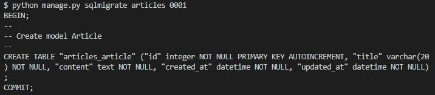

# 01

# Model

- 개념

  - 모델은 단일한 데이터에 대한 정보를 가진다.

  - 필수적인 필드, 데이터에 대한 정보를 포함하고, 각각의 모델은 단일 DB 테이블과 매핑된다.

  - 저장된 DB의 구조를 의미한다.

  - **django는 model을 통해 데이터에 접속하고 관리한다!**

    

- DB가 뭐야? -> 체계화된 데이터의 모임

- 쿼리?

  - 데이터를 조회하기 위한 명령어
  - 조건에 맞는 데이터를 추출, 조작하는 명령어

- 스키마? -

  - DB의 자료 구조, 표현방법, 관계 등을 정의한 구조

  - DBMS가 설정에 따라 스키마를 생성하고, DB 사용자가 자료를 CRUD할 때 DBMS는 자신이 생성한 DM 스키마를 참조해 명령을 수행

- 테이블

  - 필드(속성): 모델 안에 정의한 클래스에서 클래스 변수가 필드가 된다
  - 레코드(행,튜플): 우리가 ORM을 통해 해당하는 필드에 넣은 데이터를 의미
  - 기본키는 각 레코드의 고유 값인데, 반드시 설정해야 한다!

## ORM

- 개념

  - 객체지향 프로그래밍 언어를 이용해 호환되지 않는 유형의 시스템간(django-sql) 데이터를 변환하는 프로그래밍 기술이다! 프로그래밍 언어에서 사용 가능한 가상의 객체 DB를 만들어 사용한다.

- 장점

  - SQL을 몰라도 DB 연동이 가능하고, 쿼리 조작이 간능하다.
  - 절차적이 아닌 객체 지향적 접근으로 생산성 증가

- 단점

  - ORM만으로는 완벽한 서비스 구현이 어려움
  - 프로젝트가 커질수록 설계 난이도 상승

  

- 객체 지향 프로그래밍에서 DB의 편리한 관리를 위해 ORM framework를 도입

- DB를 객체로 조작하기 위해 ORM을 사용한다!


## Model

- id는 기본적으로 처음 테이블을 생성했을 때 자동으로 만들어진다!


### fields

- CharField(max_length=__)

  - 길이 제한을 두려는 문자열을 쓸 때 적용(~ 150)

  - max_length는 필수 인자!
  - 문자열 필드 -> 텍스트의 양이 많다면 TextField()를 쓰자
  - 기본 양식 위젯은 TextInput

- TextField()

  - 글의 수가 많을 때 사용
  - max_length를 쓰면 textarea 위젯에 반영은 되지만 모델, DB 수준에는 적용되지 않는다
  - 기본 양식 위젯은 Textarea

- DateTimeField(auto_now=False, auto_now_add=False)

  - 최초 생성: auto_now_add=True  
  - django ORM이 테이블에 최초로 데이터를 입력할 때 현재 날짜와 시간으로 갱신
  - 최종 수정: auto_now=True
  - django ORM이 save를 할 때마다 현재 날짜와 시간으로 갱신


### migrations

- 모델을 변경했을 때 그 변화를 반영하는 방법!

- makemigrations

  - 모델 변경에 기반한 새 migrations 만들 때 사용
  - 설계도를 작성한다고 생각하자

  

  - 만들면 db.sqlite 파일이 생성된다.

  

- migrate

  - 만들어진 설계도를 실제로 DB에 반영하는 과정
  - makemigrations로 만든 설계도를 db.sqlite3 DB에 반영
  - 모델의 변경 사항과 DB 스키마와의 동기화

  

- sqlmigrate

  - migrations에 대한 SQL구문을 보려고 할 때 사용
  - 아래처럼 DDL을 사용해 테이블이 만들어진 것을 볼 수 있다.

  

- showmigrations

  - 설계도들이 제대로 migrate되었는지의 여부를 확인 가능

- models.py에서 변경 -> makemigrations -> migrate

- DB 안에는 app이름_모델 이름으로 생성된다.


### DB api

- django가 ORM을 통해 db를 편하게 조작할 수 있게 도움
- model을 만들면 django는 객체들을 CRUD하는 api를 자동으로 만든다.
- 쿼리를 만드는 구문 
  - Article.objects.all()  (class name/manager/queryset api)
  - all() 은 Article 안의 모든 데이터를 요구하는 쿼리셋api다. 다만 그 동작을 수행하기 위해 objects라는 manager가 필요하다. 
- manager
  - models.py에 설정한 클래스를 사용할 때 DB와의 인터페이스 역할을 한다.
  - python class(models.py) ---- objects --- DB
  - 기본적으로 모든 모델 클래스에 objects라는 manager를 자동으로 추가
  - manager로 특정 데이터를 조작 가능
- queryset
  - DB로부터 데이터를 읽고, 필터하거나 정렬 등의 일을 함.
  - 쿼리셋 안의 객체는 없거나, 한 개, 또는 여러 개일 수 있음
  - DB로부터 전달받은 객체의 목록이며 objects를 사용해 복수의 데이터를 가져오는 함수를 사용할 때 반환되는 객체이다.


## CRUD

- 생성, 읽기, 수정, 삭제를 묶어서 부르는 말
- 이게 안된다면 그 소프트웨어는 반쪽짜리
- 기본적인 기능이라 한 묶음으로 설명된다.

### Create

- 우선 테이블을 사용하기 위해 import해주는 단계가 필요하다.

```
# DB에 앤스턴스 객체를 얻기 위한 쿼리문
>>> Article.objects.all()
<QuerySet []>
```

- 데이터 객체를 만드는 방법들
- 1번
  - ORM을 쓰는 이유는 DB 조작을 객체지향 프로그래밍처럼 하기 위해서이다.


- - 클래스로부터 인스턴스를 생성하고, (article = Article()) 인스턴스로 클래스 변수에 접근해 그 인스턴스 변수를 변경하고, (article.title = 'first'), 마지막으로 인스턴스로 메서드를 호출한다.(article.save())
  - 인스턴스 변수인 title, content에 값이 할당된다.
  - save를 하지 않으면 DB에는 저장되지 않는다.
- 2번
  - 함수에서 keyword 인자를 넘기듯 만든다.


- 3번
  - 더 간편하다. create()를 사용해 쿼리셋 객체 생성, 저장이 한번에 가능해진다.


- `__str__`

  - 모든 모델마다 표준 파이썬 클래스의 메서드인 str()을 정의해 각 객체가 문자열을 반환하도록 한다. 

  

  - 위처럼 str을 정의해주고 나면 각 객체가 title을 반환한다.


### Read

- all()
  - 쿼리셋을 리턴하고, 리스트는 아니지만 비슷하게 동작함.

- get() - pk 조회시 사용
  - 객체가 없으면 DoesNotExist 에러를 내고 객체가 여러개라면 MultipleObjectReturned 에러를 낸다. unique나 not null 특징이 있다면 사용 가능.


- filter()
  - 지정된 조회 매개 변수와 일치하는 객체를 포함하는 새 쿼리셋 반환
  - 맞는 객체가 없더라도 빈 쿼리셋을 반환한다.


### Update

- article 인스턴스 객체를 생성한 후 인스턴스 변수에 접근하여 값을 변경하고 save()한다.


### Delete

- 인스턴스 생성 후 `.delete()` 메서드 호출하면 없어진다.


- 이렇게 pk값이 삭제되면 재사용되지 않는다. 새로 생성을 해도 그것의 pk는 1이 아닌 4이다.


## Admin

- 서버 관리자가 활용하기 위한 페이지. recode의 생성 여부 확인에 유용하다.
- 반드시 기본 테이블 생성(migrate) 이후에 관리자를 생성해야 한다.

```
admin.site.register(모델)
```

- 위의 과정을 통해 admin 사이트에서 객체들을 관리할 수 있다.


# 오늘 한 것은?

- django는 모델을 통해 데이터에 접속하고 관리한다.
- ORM은 객체지향 프로그래밍 언어를 이용해 호환되지 않는 유형의 시스템간(django-sql) 데이터를 변환하는 프로그래밍 기술이다. 
- 모델에는 Char, Text, DateTime 등의 field들이 있다.
- 모델을 변경한 후에는 makemigrations하고, 그것을 migrate해 DB에 반영한다.
- 쿼리문을 이용해 CRUD 동작이 가능하다.